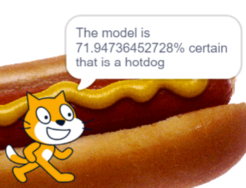

## Introduction
Welcome to Stage 2 of the Experience AI Challenge! You're about to embark on a visual odyssey where we cross the landscapes of art, machine learning, and coding.

Ever wonder how your favorite photo app distinguishes between pictures of cats and pictures of dogs? It's all due to the science of image classification. It's like equipping your computer with a tool that allows it to process and tell images apart.

At the heart of this superpower is teaching your computer what to look for. It’s kind of like teaching a baby to recognise stuff. “This is a hotdog. This isn’t.” By showing it tons of pictures, the computer starts picking up on tiny clues – like colours, shapes, and patterns in the data.

And here’s the super cool part: once you get the hang of it with hotdogs, you can teach your computer to recognise anything! Your favourite sneakers, your coolest comic book characters, or even different types of dances! The sky’s the limit once you grasp the basics of image classification. So, are you ready to give your tech some awesome vision skills? Let’s dive in!

### You will

Using the Machine Learning for Kids platform, a pinch of Scratch, and a whole lot of literary quotes, you will:
  + Build a machine learning model on Machine Learning for Kids
  + Collect text data of hotdog images and images of other things
  + Train your machine learning model on your collected images
  + Build an image classifier application that can detect hotdogs 
