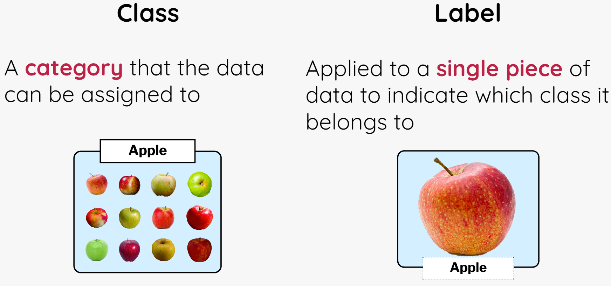

## Create your machine learning model

Imagine you're trying to cut down on hotdogs and eat more healthily. This detector can help keep you on track by alerting you whenever a sneaky hotdog is on your plate! (In case you couldn't tell!)

First, create your machine learning model on Machine Learning for Kids:

--- task ---

Open the website [Machine Learning for Kids](https://machinelearningforkids.co.uk/#!/login){:target="_blank"}.

--- /task ---

--- task ---

In the screen that appears, choose **Log In** if your mentor gave you some login details. Enter your username and password on the next screen.

Choose **Sign Up** if you are creating your own account and follow the prompts to create a new account.

--- /task ---

--- task ---

Select **Go to your Projects**.

--- /task ---

--- task ---

Select **Add a new project**.

--- /task ---

--- task ---

Give the project a name and set it to recognise **images**.

--- /task ---

--- task ---

Select **CREATE**. Once created, click on the project title.

--- /task ---

Now that you have created an blank project to recognise images, you need to set out the different ways your images will be classified - `hotdog` and `nothotdog` - these will be our **classes**.

--- collapse ---
---
title: Classes and Labels
---

**Classes** are the major categories we're trying to sort those images into. In our case, we only have two **classes**: 'hotdog' and 'not hotdog'.

**Labels** are the specific names we give to each picture in the training data to help the model identify what is in each image.

For instance, if you see an image of a hotdog in the training data, you'll label that picture as `hotdog`. By doing this, you're telling the model that this image belongs to the `hotdog` class. Similarly, if you have a picture of a banana, you'll label it `not hotdog`, placing it in the `not hotdog` class. Once you train it on this information, the model can be used to predict which class new images belong to.

You can use as many classes as you want in your model. In our scenario, it's pretty straightforward: every image is either a `hotdog` or `not hotdog`. But in other projects, you could have multiple classes based on various characteristics of the data you're working with. (The colours of the rainbow, all of your pets, your favourite pokemon....)

--- /collapse ---

--- task ---

Select **Train**. This will let you add new training data to your model.

--- /task ---
