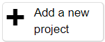

## Create your machine learning model

Imagine you're trying to cut down on hotdogs and eat more healthily. This detector can help keep you on track by alerting you whenever a sneaky hotdog is on your plate! (In case you couldn't tell!)

First, create your machine learning model on Machine Learning for Kids:

--- task ---

Open the website [Machine Learning for Kids](https://machinelearningforkids.co.uk/#!/login){:target="_blank"}.

--- /task ---

--- task ---

On the screen that appears, choose **Log In** if your mentor gave you some login details. Enter your username and password on the next screen.

Choose **Sign Up** if you are creating your own account and follow the prompts to create a new account.

--- /task ---

--- task ---

Select **Go to your projects**.

--- /task ---

--- task ---

Select **Add a new project**.

--- /task ---

--- task ---

Give the project a name and set it to recognise **images**.

--- /task ---

--- task ---

Select **CREATE**. Once created, click on the project title.

--- /task ---

Now that you have created a project that identifies images, you need to set out the different ways your images will be classified - `hotdog` and `nothotdog` - these will be our **classes**.

--- collapse ---
---
title: Classes and labels
---

**Labels** are the specific names we give to each picture so the model knows what it's looking at, while **classes** are the major categories we're trying to sort those pictures into. In our case, we only have two classes: 'hotdog' and 'not hotdog'.

For instance, if you see an image of a hotdog, you'll label that picture as 'hotdog'. By doing this, you're telling the model that this image belongs to the 'hotdog' class. Similarly, if you have a picture of a banana, you'll label it 'not hotdog', placing it in the 'not hotdog' class. The model will then use these labels to differentiate between images that are hotdogs and those that aren't.

Remember, the classes you select should help the model make clear predictions. In our scenario, it's pretty straightforward: every image is either a `hotdog` or `not hotdog`. But in other projects, you could have multiple classes based on various characteristics of the data you're working with.

--- /collapse ---

--- task ---

Select **Train**. This will let you add new training data to your model.

--- /task ---
