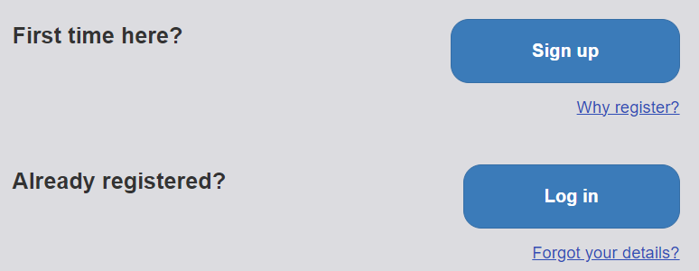
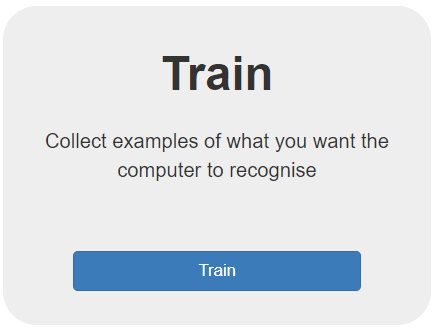

## Make a Machine Learning model

A supermarket has asked you to create a machine learning model that will recognise images of apples and tomatoes.

Your task is to set up and train a machine learning model which can do this by completing the following steps:

--- task ---

Open the website [Machine Learning for Kids](https://machinelearningforkids.co.uk/#!/login){:target="_blank"}.

--- /task ---

--- task ---

In the screen that appears, choose **Log In** if your mentor gave you some login details. Enter your username and password on the next screen.

Choose **Sign Up** if you are creating your own account and follow the prompts to create a new account.

--- /task ---

--- task ---

Select **Go to your Projects**.

--- /task ---

--- task ---

Select **Add a new project**.

--- /task ---

--- task ---

Give the project a name and set it to recognise **images**.

--- /task ---

--- task ---

Select **CREATE**. Once created, click on the project title.

--- /task ---

--- task ---

Select **Train**.

--- /task ---

--- task ---

Select **Add new label** and create a label for the `hotdog` class.

**Repeat** this step to create a second label for the `nothotdog` class.

--- /task ---

--- task ---

We have collected two image sets for training your new machine learning model here:

[[[hotdog-train]]]

[[[not-hotdog-train]]]

--- /task ---

--- task ---

Look through the training data and **choose several images of hotdogs and several images of other things** from the data. The more images of each type you pick, the more accurate your model will be.

Drag and drop your chosen images into the relevant class (`hotdog` or `nothotdog`).

--- /task ---

--- task ---

Select **Back to project**.

--- /task ---

--- task ---

Next, select **Learn & Test**.

Your model is now ready to be trained. 

--- /task ---

--- task ---

Select **Train new machine learning model**.

You will have to wait a moment while the model trains.

--- /task ---

### Testing your model

Now that you have trained your model, it is time to test it to see how successful it is.  
Some data has been kept aside to use as test data.

When we want a computer program to learn a specific task, we give it a set of data to learn from. This set of data is called `training data`. It's like the exercises in your textbook that come with answers. You use these exercises to practice and understand the topic.

Once the program has learned from the training data, we need to check how well it has understood the task. To do this, we give it a new set of data it hasn't seen before, called `testing data`. This is similar to the questions on a quiz or test at school. The questions on the test aren't the exact ones you practiced with, but they're about the same topic.

**Why Keep Them Separate?**
If we use the same data for both training and testing, it's like giving you a math test with the exact same questions you practiced with. You might get all the answers right, but it doesn't show if you understand the topic broadly. It only shows that you know those specific questions.

Similarly, if we test the computer program with the same data it trained on, we can't be sure if it has learned the task broadly or if it just "remembers" that specific data. By using different data for testing, we can get a better idea of how well the program can handle new, unseen situations.

So, it's essential to keep training and testing data separate to ensure that the computer program can perform the task accurately in various situations, not just the ones it has seen before.

To see how successful your model is at classifying the test data, test your model with some of the images:

--- task ---

Drag and drop an image into the link box (next to the Test with www button):

--- collapse ---
---
title: Adding a test image without drag and drop
---

Alternatively, you can:

+ Right-click on an image
+ Select Copy image address
+ Paste the image address into the link box

--- /collapse ---

**You can find the testing images here:**

[[[hotdog-test]]]

[[[nothotdog-test]]]

--- /task ---

--- task ---

Click the **Test with www** button to test your model.

--- /task ---

--- task ---

Once you have tested a few of the images, answer the following questions in your **blueprint**:

1. Describe the results of your testing. How accurate was the model? 
2. Why do you think the prediction is sometimes  wrong?
3. How could you improve the accuracy of the model?

--- /task ---

### Bias and data

When we teach a computer to recognize different things, like dogs and cats, we need to give it lots of examples to learn from. These examples are called **training data**.

If we use a training dataset that contains mostly small dogs and large cats, this does not accurately represent the real world as there are also large dogs and small cats. If the data used to train the model is not representative of what you're trying to model, neither will the prediction be which your model makes.

This is called **bias**, which means the computer is favoring one thing over another. We can fix this by using a more diverse training dataset that includes different sizes and breeds of dogs and cats. By doing this, we can help the computer learn to recognize the features that distinguish each type of animal, rather than just relying on the size of the training examples.

By using more diverse and representative training data, we can help ensure that the computer makes accurate and fair predictions when it encounters new examples. This can make the computer more useful and reliable for different applications, from sorting pet adoption photos to assisting veterinarians in diagnosing animal health issues.

Let's start making your machine learning application in Scratch and think about what it will do!