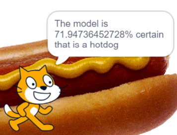

## Make a Scratch application to classify images

<div style="display: flex; flex-wrap: wrap">
<div style="flex-basis: 200px; flex-grow: 1; margin-right: 15px;">
Your model is trained, tested, and ready to use, but to use it you need to create a Scratch project that allows your user to input images and classify the input as `hotdog` or `nothotdog`.
</div>
<div>
{:width="300px"}
</div>
</div>


### **Your project will:**
+ Take image inputs from the user
+ Use your trained ML model to classify the images
+ Tell the user whether the thing in the picture is a hotdog or not

--- task ---

On your [**project page**](https://machinelearningforkids.co.uk/#!/projects){:target="_blank"}, select **Make**:


--- /task ---

--- task ---

On the next page, select **Scratch 3**.


--- /task ---

<div style="display: flex; flex-wrap: wrap">
<div style="flex-basis: 200px; flex-grow: 1; margin-right: 15px;">
A special fork of Scratch will open in a new tab. When it does, you will see an item in the left-hand menu with the same name as your machine learning project.

The new grey blocks you can see in that menu allow you to access your machine learning model from within your project:
</div>
<div>
{:width="100px"}
</div>
</div>

--- collapse ---
---
title: Pro tip - Save your work!
---

This special version of Scratch allows you to access your machine learning model, **but** if you try to open your project in another version of Scratch online **it won’t work**. 

A solution to this is to save your work to your computer. Once you have the .sb3 file for your project saved, you can open it again later, or on another computer:
+ Go to [rpf.io/mlscratch](rpf.io/mlscratch){:target="_blank"} to get to this special fork of Scratch 
+ Once Scratch opens, choose **File** > **Load from your computer**
+ Select your file in the window that appears to return to where you left off


Save your work as often as you can to make sure you don’t lose any progress!

--- /collapse ---

--- task ---

Add a `when green flag clicked`{:class="block3events"} block to your workspace. This is the script that will run the first time you start the project. 

```blocks3
when green flag clicked
```

--- /task ---

--- task ---

From the golden `control`{:class="block3control"} menu, add an `if / else`{:class="block3control"} block to your script.

```blocks3
when green flag clicked
if <> then

else

end

```

--- /task ---

Your application needs to classify the image your user has uploaded as `hotdog` or `nothotdog`. To do this, it needs to compare the uploaded image against the `hotdog` class in the model.

--- task ---

From the green `Operators`{:class="block3operators"} menu, place a gem shaped `=`{:class="block3operators"} block into the hole in the golden `if / else`{:class="block3control"} block:

```blocks3
when green flag clicked
if <<()=(50)>> then

else

end

```

--- /task ---

--- task ---

Into the first space, place a black `recognise image (`image`) (label)` block from the Machine Learning for Kids menu at the very bottom.

```blocks3
when green flag clicked
if <((recognise image [image] label :: #4b4c60))=(50)> then

else

end
```

--- /task ---

--- task ---

Into the second gap (where it says `50`), place a round black `hotdog` bubble from the Machine Learning for Kids menu at the very bottom.

```blocks3
when green flag clicked
if <(recognise image [image] label :: #4b4c60)=((hotdog :: #4b4c60))> then

else

end
```

--- /task ---

--- task ---

From the purple `Looks`{:class="block3looks"} menu, add a `say (Hello!)`{:class="block3looks"} block to your script in the top slot:

```blocks3
when green flag clicked
if <(recognise image [image] label :: #4b4c60)=(hotdog :: #4b4c60)> then
say [Hello!]
else

end
```

--- /task ---

Now, you're going to create the message your application will show to the user when it has classified their image. To do that, you're going to `join`{:class="block3operators"} some bits of text (called strings) with data from your machine learning model using specific blocks. 

The example message will say: "The model is `(confidence: number)`% certain that is a `(model label: hotdog/nothotdog)`%  !

--- task ---

From the green `Operators`{:class="block3operators"} menu, place a round `join (apple) (banana)`{:class="block3operators"} block into the space in the purple `say`{:class="block3looks"} block:

```blocks3
when green flag clicked
if <(recognise image [image] label :: #4b4c60)=(hotdog :: #4b4c60)> then
say ((join [apple] [banana]))
else

end
```

--- /task ---

--- task ---

Add another round `join (apple) (banana)`{:class="block3operators"} block into the gap in the block you just added (it doesn't matter which gap you put it in):

```blocks3
when green flag clicked
if <(recognise image [image] label :: #4b4c60)=(hotdog :: #4b4c60)> then
say (join ((join [apple] [banana])) [banana])
else

end

```

--- /task ---

--- task ---

Add one last round `join (apple) (banana)`{:class="block3operators"} block into the other gap in the first block you added:

```blocks3
when green flag clicked
if <(recognise image [image] label :: #4b4c60)=(hotdog :: #4b4c60)> then
say (join (join [apple] [banana]) ((join [apple] [banana])))
else

end

```
--- /task ---

--- task ---

Into the first gap that says `apple`, type `The model is ` 
Make sure you include a space at the end!

```blocks3
when green flag clicked
if <(recognise image [image] label :: #4b4c60)=(hotdog :: #4b4c60)> then
say (join (join [The model is ] [banana]) (join [apple] [banana]))
else

end
```
--- /task ---

--- task ---

Into the second gap, which says `banana`, drag a black `recognise image [image] (confidence)` block from the Machine Learning for Kids menu at the very bottom:

```blocks3
when green flag clicked
if <(recognise image [image] label :: #4b4c60)=(hotdog :: #4b4c60)> then
say (join (join [The model is  ] (recognise image [image] confidence :: #4b4c60)) (join [apple] [banana]))
else

end
```
--- /task ---

--- task ---

Into the next (third) gap, which still says `apple`, type `% certain that is a ` 
Make sure you include a space at the end!

```blocks3
when green flag clicked
if <(recognise image [image] label :: #4b4c60)=(hotdog :: #4b4c60)> then
say (join (join [The model is  ] (recognise image [image] confidence :: #4b4c60)) (join [% certain that is a ] [banana]))
else

end
```
--- /task ---

--- task ---

Into the last (fourth) gap, which still says `banana`, drag a black `recognise image [image] (label)` block from the Machine Learning for Kids menu at the very bottom:

```blocks3
when green flag clicked
if <(recognise image [image] label :: #4b4c60)=(hotdog :: #4b4c60)> then
say (join (join [The model is ] (recognise image [image] confidence :: #4b4c60)) (join [% certain that is a ] (recognise image [image] label :: #4b4c60)))
else

end
```

--- /task ---

The final piece of the puzzle is to now use the image your user entered as the information sent back to the model for classification!

--- task ---

From the aqua-coloured `Images`{:class="block3operators"} menu, drop three round `backdrop image`{:class="block3operators"} bubbles into the white slots that say `image`:

```blocks3
when green flag clicked
if <(recognise image (backdrop image :: #3fbc8d) label :: #4b4c60)=(hotdog :: #4b4c60)> then
say (join (join [The model is  ] (recognise image (backdrop image :: #3fbc8d) confidence :: #4b4c60)) (join [% certain that is a ] (recognise image (backdrop image :: #3fbc8d) label :: #4b4c60)))
else

end

```

--- /task ---

--- task ---

Right-click (or two-finger click on a Mac) on your purple `say` block and choose **Duplicate**.

Place the new block into the second slot of the `if / else` block:

```blocks3
when green flag clicked
if <(recognise image (backdrop image :: #3fbc8d) label :: #4b4c60)=(hotdog :: #4b4c60)> then
say (join (join [The model is  ] (recognise image (backdrop image :: #3fbc8d) confidence :: #4b4c60)) (join [% certain that is a ] (recognise image (backdrop image :: #3fbc8d) label :: #4b4c60)))
else
say (join (join [The model is  ] (recognise image (backdrop image :: #3fbc8d) confidence :: #4b4c60)) (join [% certain that is a ] (recognise image (backdrop image :: #3fbc8d) label :: #4b4c60)))
end

```
--- /task ---

--- task ---

Remove the final green `join` block from your second `say` block:

```blocks3
when green flag clicked
if <(recognise image (backdrop image :: #3fbc8d) label :: #4b4c60)=(hotdog :: #4b4c60)> then
say (join (join [The model is  ] (recognise image (backdrop image :: #3fbc8d) confidence :: #4b4c60)) (join [% certain that is a  ] (recognise image (backdrop image :: #3fbc8d)  label :: #4b4c60)))
else
say (join (join [The model is  ] (recognise image (backdrop image :: #3fbc8d) confidence :: #4b4c60)) [banana])
end

```
--- /task ---

--- task ---

Replace the word `banana` with the text `% certain that is NOT a hotdog!`:

```blocks3
when green flag clicked
if <(recognise image (backdrop image :: #3fbc8d) label :: #4b4c60)=(hotdog :: #4b4c60)> then
say (join (join [The model is  ] (recognise image (backdrop image :: #3fbc8d) confidence :: #4b4c60)) (join [% certain that is a ] (recognise image (backdrop image :: #3fbc8d) label :: #4b4c60)))
else
say (join (join [The model is  ] (recognise image (backdrop image :: #3fbc8d) confidence :: #4b4c60)) [% certain that is NOT a hotdog!])
end

```

--- /task ---


--- task ---

Add a new backdrop from your test images online. You can do this by copying and pasting the image address into the `Upload Backdrop` menu in Scratch:

--- collapse ---
---
title: Upload a backdrop in Scratch 3
---

You can upload a new backdrop image in Scratch by clicking the backdrop menu in the bottom left of your screen.


Choose the Upload symbol from the list: 


In the window that pops up, paste the `image address` of the test image:


Click **Open**.

--- /collapse ---


--- /task ---


--- task ---

**Click the green flag**

Your character will say whether the new backdrop image is a hotdog or not and to what certainty!

--- /task ---

In the next step, you can customise the way your application looks by adding costumes and some new features that activate depending on the classification of your input.

