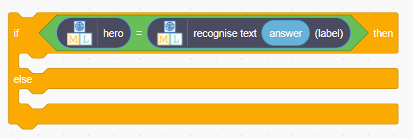
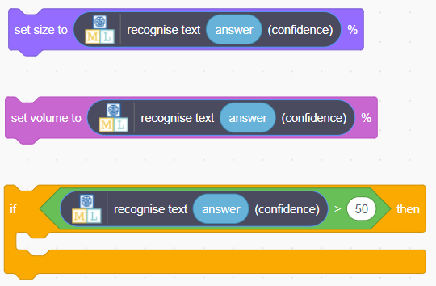

## What next?

Now it's time to upgrade your project to make it more fun or interesting!

You could:
+ Add a new costume to the sprite to replace the Scratch cat:
[[[scratch3-add-costumes-to-a-sprite]]] 

+ Add a new backdrop to your project:
[[[generic-scratch3-backdrop-from-library]]]

+ Add sounds to your project:
[[[generic-scratch3-sound-from-library]]]

+ Make your application do something depending on whether the model says 'hotdog' or 'nothotdog':

--- collapse ---
---
title: Make changes based on the label
---

Use an `if/else`{:class="block3control"} block with an equals operator to check if the label for the input is 'hotdog'. **If** it is, do something. Otherwise, do something else. This could be `change costume to []`{:class="block3looks"} or `play sound []`{:class="block3sound"}, or anything you like!

--- /collapse ---

+ Make your application do something based on how confident the model is about its prediction:

--- collapse ---
---
title: Make changes based on the confidence of the model
---

Use the `recognise image (backdrop image) confidence` block with size and volume controls, or have something happen if the confidence is above or below a certain level:

--- /collapse ---

**This was just the warm up!** Now that you know how to build an image classification application that can detect hotdogs, you can decide what **you** want to make next! 

In the next stage of the Experience AI Challenge, you'll get to use the skills you've learnt in this project to create something totally cool and unique using Scratch and machine learning! 

--- task ---

[Click here](https://projects.raspberrypi.org/en/projects/xai-challenge-submit/) to take the next exciting step in creating your own artificial intelligence app!

--- /task ---
